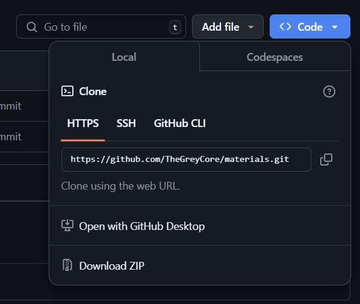

# Mis asi on GitHub ja Git?

Tere tulemast Giti ja GitHubi maailma! Siin on lihtne ja sõbralik juhend, mis aitab sul alustada. Kujuta ette, et Git on nagu päevik, kuhu sa kirjutad üles kõik oma projekti muudatused, ja GitHub on nagu suur raamatukogu, kus sa saad oma päevikut teistega jagada.


## Mis on Git?
**Git** on  vabavaraline hajutatud versioonihaldussüsteem, mida kasutatakse koodi ja muude failide jälgimiseks ja haldamiseks suuremääraliselt igas IT firmas. See võimaldab arendajatel koostööd teha, jälgida muudatusi ja hallata erinevaid projekti versioone. Näiteks Git-ga on võimalik, et mitu inimest töötavad ühe projekti kallal ilma selleta, et peaksid muudatusi jägama läbi mõne muu ebamugava viisi.


## Mis on GitHub?
**GitHub** on populaarne (suuremäraliselt tasuta) veebipõhine platvorm, mis kasutab Giti versioonihaldussüsteemi. See pakub tööriistu ja funktsioone, mis lihtsustavad koostööd, koodi jagamist ja projektide haldamist. GitHub võimaldab arendajatel luua hoidlaid (repositories), teha muudatusi (commits), luua harusid (branches) ja palju muud. GitHubi üheks heaks plussiks on see, et GitHub analüüsib sinu koodi ja juhul kui seal on olemas mõni API võti või mõni turvauguga teek (*libary/dependency*) annab ta sulle sellest teada.

## Terminoloogia
Repository (hoidla): Kogum faile ja kaustu, mida hallatakse Giti abil. Hoidla sisaldab kogu projekti ajalugu ja kõiki versioone.

Commit (muudatus): Muudatuste kogum, mis salvestatakse hoidlasse. Iga commit sisaldab sõnumit, mis kirjeldab tehtud muudatusi.

Branch (haru): Eraldi arendusliin, mis võimaldab töötada projekti erinevate versioonidega paralleelselt. Harud võimaldavad arendajatel katsetada uusi funktsioone ilma, et see mõjutaks projekti põhiversiooni.
```plaintext
Isiklikult soovitan võimalusel kasudata vähemalt kahte haru, kus ühes on põhiprojekt (main/master) ja teises funktsioonid mida parajasti veel luuakse ja pole hästi testitud.
```

# GitHub hoidla loomine

Siin osas on olemas väga hea juhend GitHubi poolt [[Vajuta mind]](https://github.blog/developer-skills/github/beginners-guide-to-github-repositories-how-to-create-your-first-repo/)

*Kui lood oma hoidla kujuta ette, et sa alustad uut päevikut, kuhu hakkad oma projekti muudatusi kirja panema.*

# Hoidla oma arvutisse hankimine
Enne kui saad oma hoidla muuta ja sinna faile lisada pead sa selle hoidla endale arvutisse kloonima. Selleks on olemas käsk:
```bash
git clone https://github.com/**Sinu kasutaja nimi**/**Hoidla nimi**.git
```
Linki on võimalik kopeerida vajutades nuppu `<> Code`



# Git-i kasutamine

### Näidisfaili loomine
Loome endale näidisfaili, ütleme, et see on meie päeviku esimene lehekülg.
```bash
echo "<html><body><h1>Tere, maailm!</h1></body></html>" > index.html
```
See käsk loob `index.html` faili järgmise sisuga:
```html
<html>
<body>
<h1>Tere, maailm!</h1>
</body>
</html>
```

## Hoidla staatuse kontrollimine

### Staatus
See käsk näitab, millised failid on muutunud, millised on lisamata ja millised on valmis commitimiseks. See oleks nagu kontrollimine, millised leheküljed sinu päevikus on veel mustandis ja millised on valmis lõplikuks salvestamiseks.
```bash
git status
```

Näide väljundist:
```plaintext
On branch main
No commits yet

Untracked files:
  (use "git add <file>..." to include in what will be committed)
    index.html

nothing added to commit but untracked files present (use "git add" to track)
```

## Muudatuste tegemine

### Faili muutmine
Soovid oma päevikusse lisada uue lõigu, selleks muuda `index.html` faili ja lisa näiteks uus rida:
```html
<p>Giti kasutamine pole üldse raske!</p>
```

## Muudatuste lisamine ja üleslaadimine

### Muudatuste lisamine
Kujuta ette, et sa paned oma päeviku leheküljed kausta, et need oleksid valmis lõplikuks salvestamiseks.

Selleks on olemas käsk, mis lisab faili muudatused "staging area"-le, mis tähendab, et need on valmis commitimiseks.
```bash
git add index.html
```
*Pane tähele, et ilma selle käsuta muudatud failid ei lisandu commiti. Seal hulgas saad lisada kõik muudatud failid kasutades käsku:*
```bash
git add *
```

### Muudatuste commitimine
Commitid on nagu verstapostid, mis aitavad jälgida projekti ajalugu.

Omakorda alltootud käsk salvestab kõik staged muudatused hoidlasse koos sõnumiga, mis kirjeldab tehtud muudatusi.
```bash
git commit -m "Lisatud tervitustekst ja näidisrida"
```

Näide väljundist:
```plaintext
[main (root-commit) 1a2b3c4] Lisatud tervitustekst ja näidisrida
 1 file changed, 2 insertions(+)
 create mode 100644 index.html
```

### Muudatuste üleslaadimine GitHubi

Käsk laadib sinu commitid üles GitHubi. 
See on nagu oma päeviku koopia saatmine raamatukokku, et teised saaksid seda lugeda ja sina saaksid sellele igalt poolt ligi.
```bash
git push
```

## Harude tegemine

### Uue haru loomine
Kujuta ette, et sa alustad uut peatükki oma päevikus, et katsetada uusi ideid.

See käsk loob uue haru nimega "uus-haru". Harud võimaldavad sul töötada projekti erinevate versioonidega paralleelselt, ilma et see mõjutaks põhiversiooni.

```bash
git branch uus-haru
```

### Harule lülitumine
See käsk lülitab sind uuele harule.
```bash
git checkout uus-haru
```
 Nüüd saad teha muudatusi selles harus, ilma et see mõjutaks põhiharu. See oleks nagu uue peatüki lugemine ja kirjutamine oma päevikus.

## Harude vahel liikumine

### Harule lülitumine
See käsk lülitab sind tagasi põhiharule.
```bash
git checkout main
```
See käsk on kasulik, kui tahad vaadata või muuta põhiversiooni. 
Kujuta ette, et sa lähed tagasi oma päeviku põhiteksti juurde.

## Harude ühendamine main haruga

### Haru ühendamine
On kasulik, kui oled uues harus teinud muudatusi, mida tahad lisada põhiversiooni kasutada käsku:
```bash
git merge uus-haru
```
Kujutada ette saad, et sa lisad oma uue peatüki põhiteksti juurde.

Näide väljundist:
```plaintext
Updating 1a2b3c4..5d6e7f8
Fast-forward
 index.html | 1 +
 1 file changed, 1 insertion(+)
```

## Harude kustutamine

### Haru kustutamine
Kui haru pole enam vajalik ja kõik muudatused on ühendatud põhiharuga võiks haru eemaldada:
```bash
git branch -d uus-haru
```
Põhimõtteliselt sa viskad ära mustandilehed, mida sa enam ei vaja.

Näide väljundist:
```plaintext
Deleted branch uus-haru (was 5d6e7f8).
```

Loodan, et see juhend oli abiks! Head git kasutamist!
